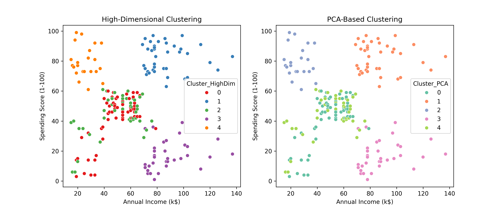
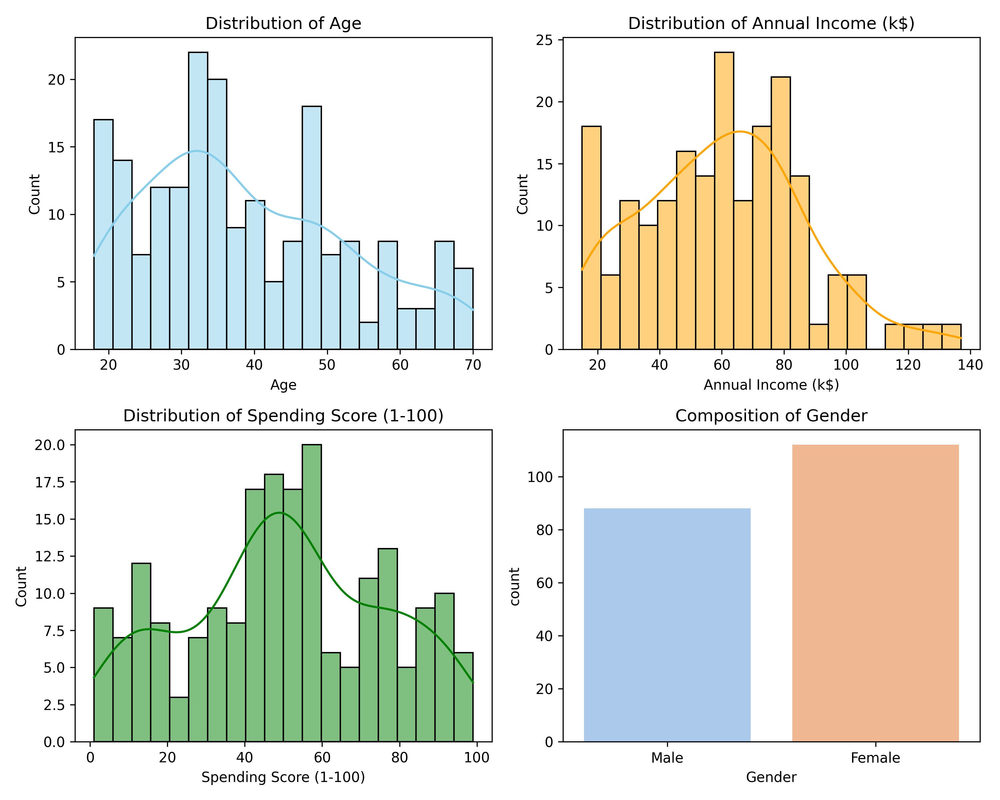
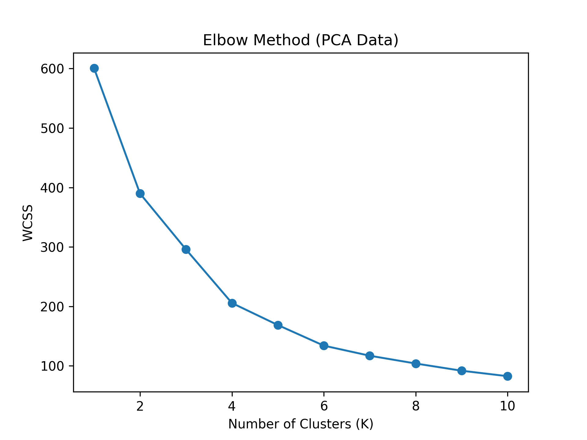
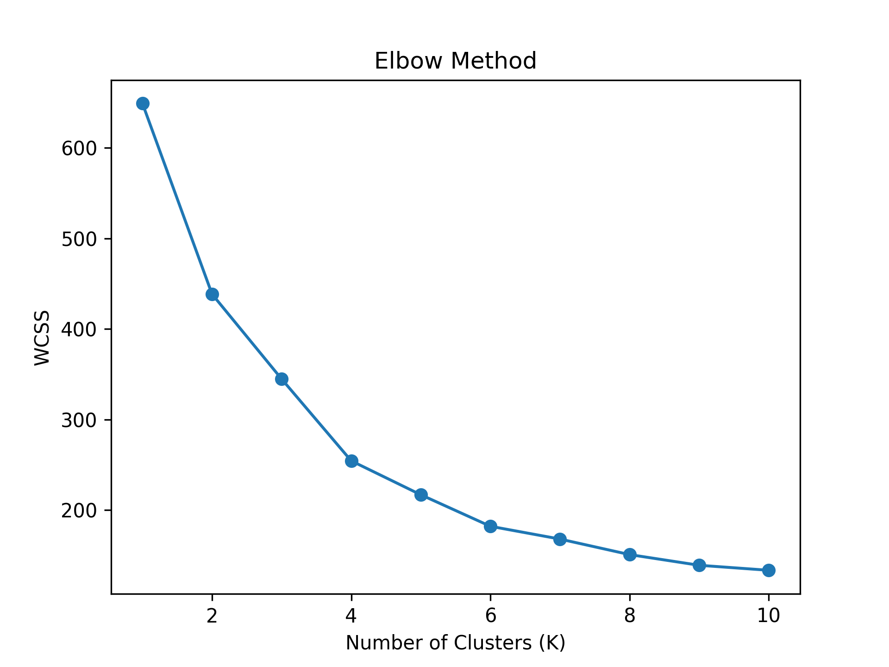
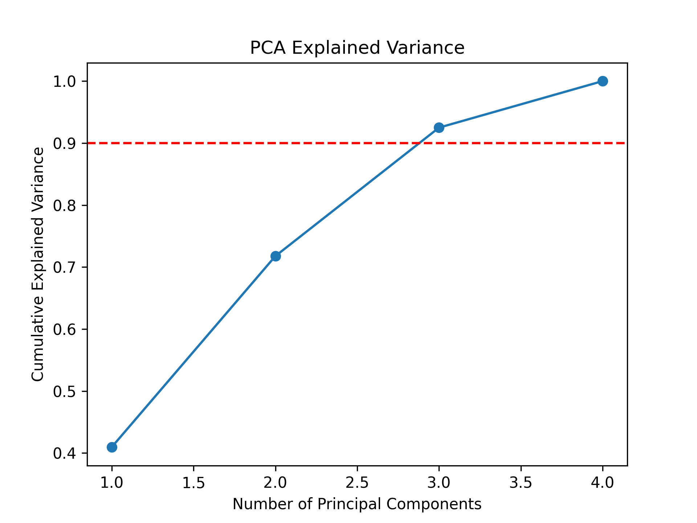
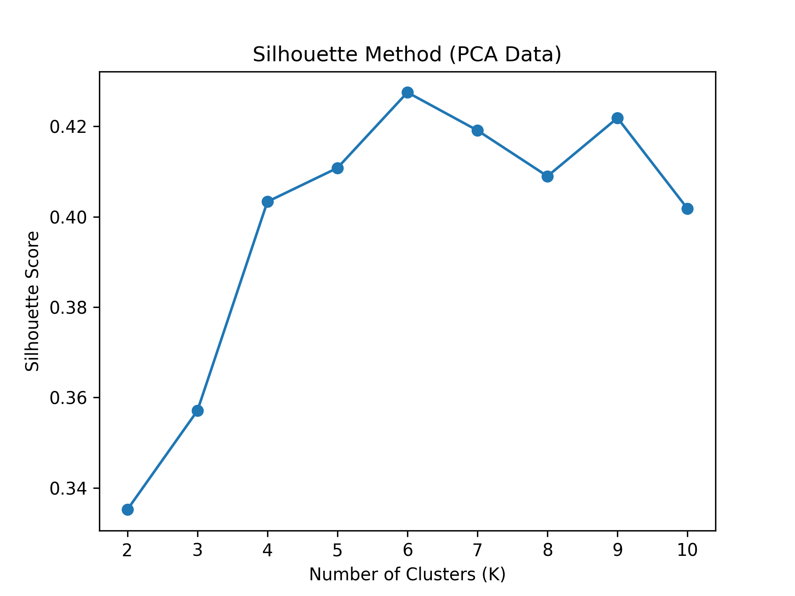
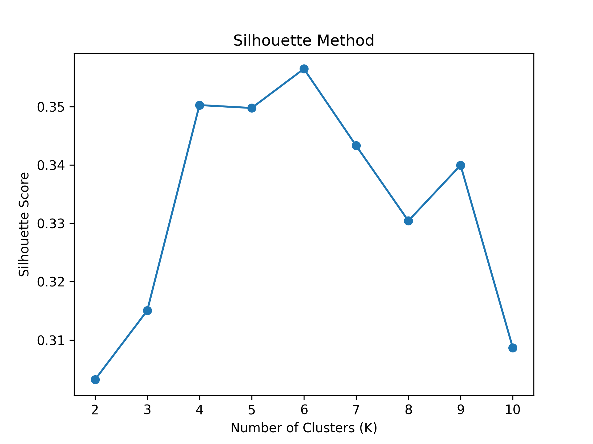

# 5. Report.md Content

## a) Methodology Comparison
Clustering on high-dimensional data provides direct use of all features, but it may suffer from the *curse of dimensionality*, where distances become less meaningful. PCA reduces redundancy and noise, leading to more compact and interpretable clusters. If the Silhouette Score improved with PCA, it indicates PCA helped uncover stronger structures. However, PCA sacrifices feature interpretability since components are linear combinations of original variables.

## b) PCA Interpretation
Suppose we selected **7 components** that captured **92% of variance**. This suggests that the dataset contained strong correlations and redundancies, as fewer dimensions were sufficient to retain most information. While PCA axes are not directly interpretable, the success of dimensionality reduction indicates that the original features had overlapping or redundant information.

## c) Connecting Unsupervised Learning to Model Generalization
If we now build a supervised model (e.g., Decision Tree) to predict customer segments, we must be aware of **Overfitting** — when the model memorizes training data patterns but fails on unseen data. To mitigate this, we use **K-Fold Cross-Validation**, which splits the dataset into K folds. The model is trained on K-1 folds and tested on the remaining fold, rotating until all folds are used. This ensures robust evaluation and improves generalization to new customers.

## Assumptions
- The dataset has been fully preprocessed before applying KMeans or PCA.  
- The optimal number of clusters (K) is determined using both the Elbow Method and Silhouette Score.  
- PCA is applied only for dimensionality reduction and not for feature interpretability.  
- The exact number of PCA components (7 in this case, explaining 92% variance) is based on the cumulative variance curve.  
- When comparing clustering approaches, the better solution is chosen based on Silhouette Score and visual interpretability.  
- For the supervised learning extension, we assume enough labeled customer data is available to train and validate models using K-Fold Cross-Validation.  

## Files produced:
1. 
2. 
3. 
4. 
5. 
6. 
7. 